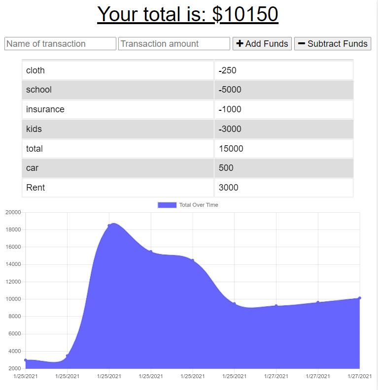

# Budget Tracker

# Deployed link:-
(https://aqueous-taiga-08169.herokuapp.com/)

# Description

User will be able to add expenses and deposits to their budget with or without a connection. When entering transactions offline, they should populate the total when brought back online.
Offline Functionality:

* Enter deposits offline

* Enter expenses offline

When brought back online:

* Offline entries should be added to tracker.

#

#

# Table of Contents

* [Installation](#installation)

* [Usage](#usage)

* [License](#license)

* [Contributing](#contributing)

* [Tests](#tests)

* [Questions](#questions)

# Installation

Dependencies must be installed to run the application properly: 

* express
* mongoose
* morgan
* compression
* lite-server

# Usage

An app that trackes Budget!

# License

This project is license under the **MIT** license.

# Contributing

* Contributor: Bethlehem Balcha

# Tests

To run tests, you need to run the following command:

# Questions

* If you have any questions:-

* GitHub username: @bettycode

* Email: betty.haile.us@gmail.com

